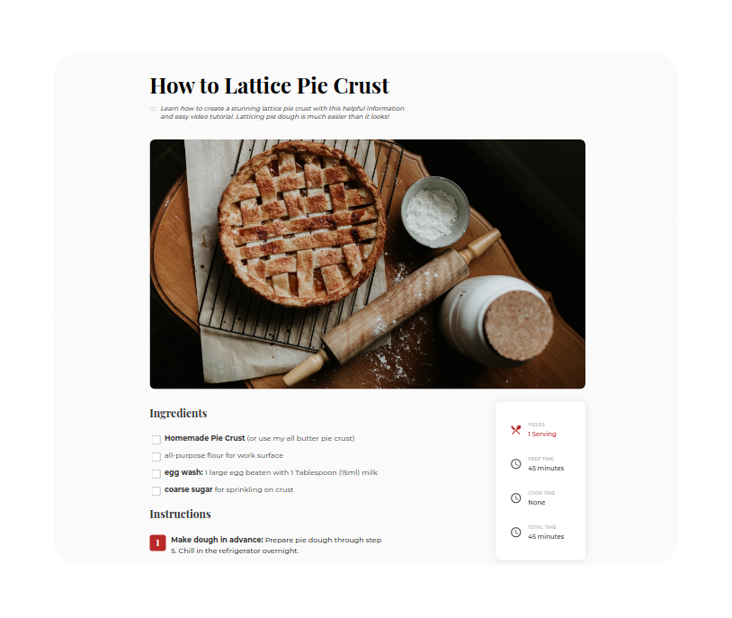

<!-- Please update value in the {}  -->

<h1 align="center">Recipe Blog</h1>

<div align="center">
   Solution for a challenge from  <a href="http://devchallenges.io" target="_blank">Devchallenges.io</a>.
</div>

<div align="center">
  <h3>
    <a href="https://flacial.github.io/dc-recipe-blog/">
      Demo
    </a>
    <span> | </span>
    <a href="https://github.com/flacial/dc-recipe-blog">
      Solution
    </a>
    <span> | </span>
    <a href="https://{your-url-to-the-challenge}">
      Challenge
    </a>
  </h3>
</div>

<!-- TABLE OF CONTENTS -->

## Table of Contents

- [Features](#features)
- [How to use](#how-to-use)
- [Contact](#contact)
- [Acknowledgements](#acknowledgements)


## Overview



- What was your experience?
  - It wasn't hard, but took a while because of the copy-pasting.
## Features

<!-- List the features of your application or follow the template. Don't share the figma file here :) -->

This application/site was created as a submission to a [DevChallenges](https://devchallenges.io/challenges) challenge. The [challenge](https://devchallenges.io/challenges/TtUjDt19eIHxNQ4n5jps) was to build an application to complete the following user stories:

- [x] User story: This is a completed user stories

## How To Use

To clone and run this application, you'll need [Git](https://git-scm.com) and [Node.js](https://nodejs.org/en/download/) (which comes with [npm](http://npmjs.com)) installed on your computer. From your command line:

```bash
# Clone this repository
$ git clone https://github.com/your-user-name/your-project-name

# Install dependencies
$ npm install

# Run the app
$ npm start
```

## Acknowledgements

<!-- This section should list any articles or add-ons/plugins that helps you to complete the project. This is optional but it will help you in the future. For exmpale -->

- Stackoverflow :)

## Contact

- GitHub [@flacial](https://github.com/flacial)
- Twitter [@flacial](https://twitter.com/flacial)
