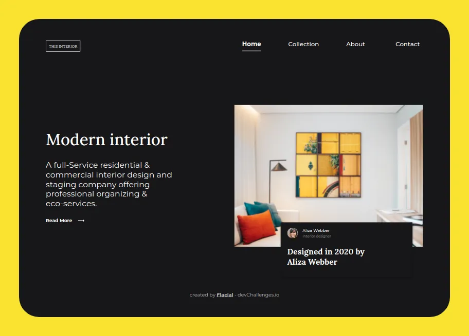

<!-- Please update value in the {}  -->

<h1 align="center">Interior Consultant</h1>

   Solution for a challenge from  <a href="http://devchallenges.io" target="_blank">Devchallenges.io</a>.

  <h3>
    <a href="https://flacial.github.io/interior-consultant/">
      Demo
    </a>
     | 
    <a href="https://github.com/flacial/interior-consultant/">
      Solution
    </a>
     | 
    <a href="https://devchallenges.io/challenges/Jymh2b2FyebRTUljkNcb">
      Challenge
    </a>
  </h3>

<!-- TABLE OF CONTENTS -->

## Table of Contents

- [Overview](#overview)
- [Features](#features)
- [Contact](#contact)

<!-- OVERVIEW -->

## Overview

- What was your experience?
  - It was really fun building the layout and using fonts.
- What have you learned/improved?
  - Build a responsive layout with the grid system.
- Your wisdom?
  - Using a variety of fonts makes the site looks elegant!

## Features

<!-- List the features of your application or follow the template. Don't share the figma file here :) -->

This application/site was created as a submission to a [DevChallenges](https://devchallenges.io/challenges) challenge. The [challenge](https://devchallenges.io/challenges/Jymh2b2FyebRTUljkNcb) was to build an application to complete the given user stories.

- User story: I can see a page following the given design
- User story: On mobile, I can see a collapsed navigation
- User story: On mobile, when I select the hamburger menu, I can see a navigation
## Contact

- GitHub [@flacial](https://github.com/flacial)
- Twitter [@HandsomeFlacial](https://twitter.com/HandsomeFlacial)
