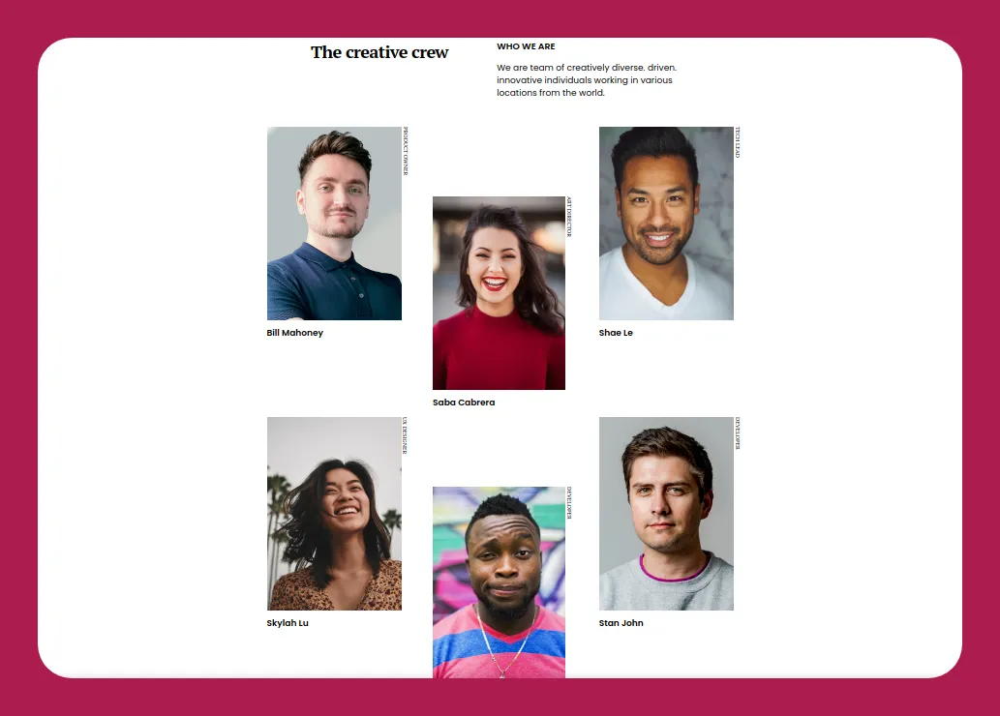

<!-- Please update value in the {}  -->

<h1 align="center">Future Team Page</h1>

   Solution for a challenge from  <a href="http://devchallenges.io" target="_blank">Devchallenges.io</a>.

  <h3>
    <a href="https://flacial.github.io/my-team-page">
      Demo
    </a>
     | 
    <a href="https://github.com/flacial/my-team-page">
      Solution
    </a>
     | 
    <a href="https://devchallenges.io/challenges/hhmesazsqgKXrTkYkt0U">
      Challenge
    </a>
  </h3>

<!-- TABLE OF CONTENTS -->

## Table of Contents

- [Overview](#overview)
- [Features](#features)
- [Contact](#contact)
- [Acknowledgements](#acknowledgements)

<!-- OVERVIEW -->

## Overview

- What was your experience?
  - It was a bit hard.
- What have you learned/improved?
  - Arranging multiple elements using Grid
- Your wisdom? 
  - Don't understimate the projects.

## Features

<!-- List the features of your application or follow the template. Don't share the figma file here :) -->

This application/site was created as a submission to a [DevChallenges](https://devchallenges.io/challenges) challenge. The [challenge](https://devchallenges.io/challenges/hhmesazsqgKXrTkYkt0U) was to build an application to complete the given user stories.

- User story: I can see a page following the given design

## Acknowledgements

<!-- This section should list any articles or add-ons/plugins that helps you to complete the project. This is optional but it will help you in the future. For exmpale -->

- [Stackoverflow - Absolute Positioning](https://stackoverflow.com/questions/11972286/absolute-position-rotated-element-to-right-corner/36357019)

## Contact

- GitHub [@flacial](https://github.com/flacial)
- Twitter [@HandsomeFlacial](https://twitter.com/HandsomeFlacial)
